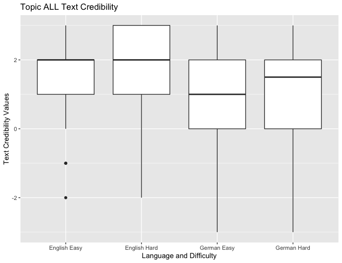
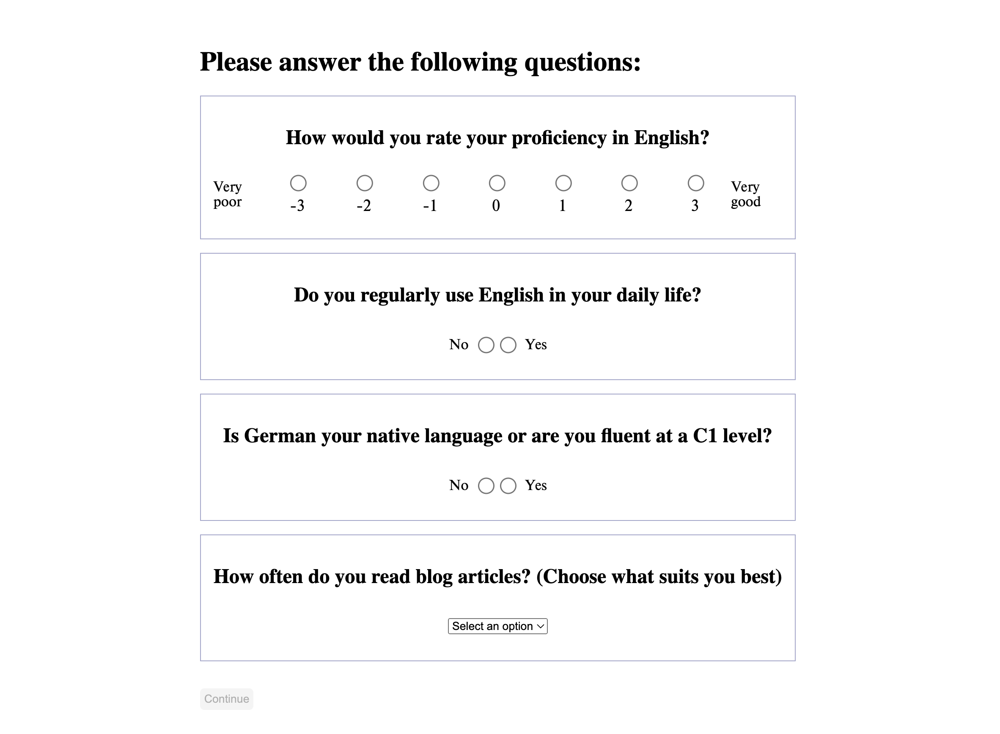
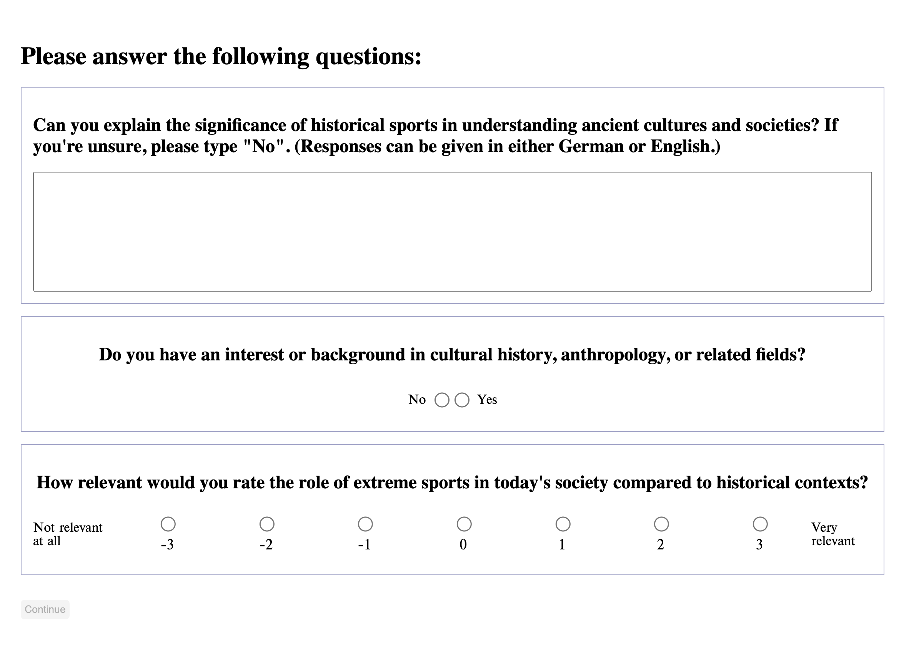
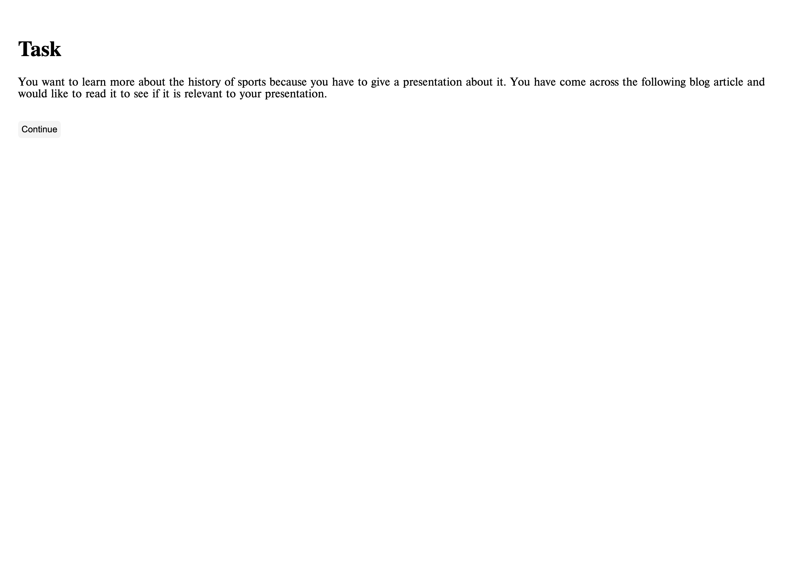
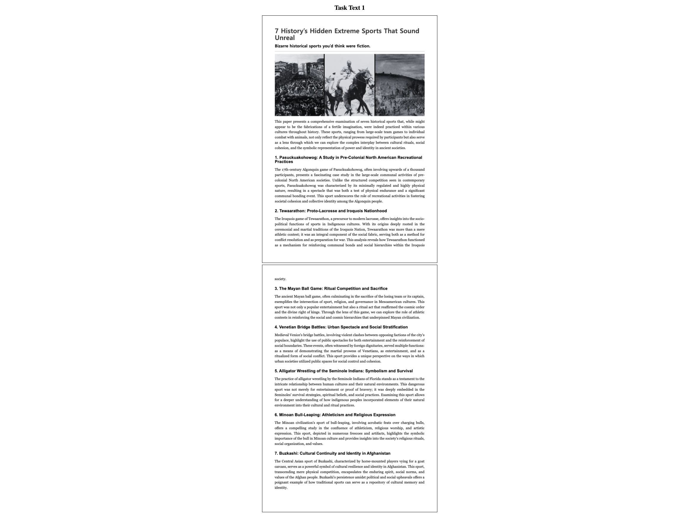
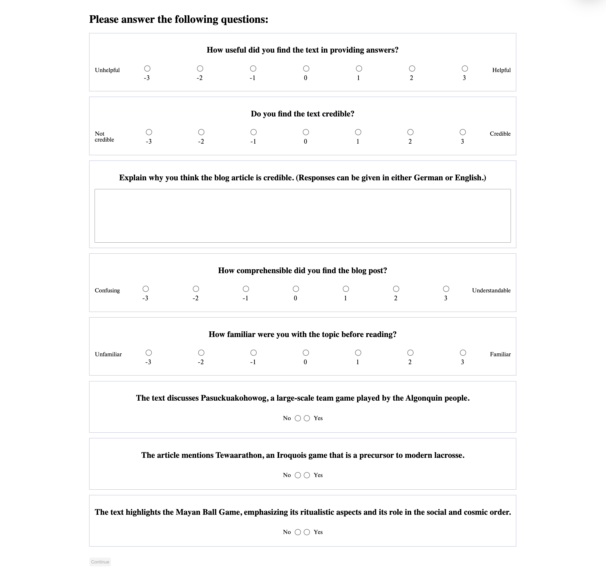

# Linguistic-Influence-Credibility-Study

[System Branch](https://github.com/NoahMeissner/Linguistic-Influence-Credibility-Study/tree/System) 
[Statistical Analysis](https://github.com/NoahMeissner/Linguistic-Influence-Credibility-Study/tree/Statistical-Analysis)

## Abstract
In the digital age, blog posts have become increasingly important as sources of information. We conducted a study (n = 32) to investigate the relationship between language and credibility by examining the effect of language choice on the perceived credibility of educational blog articles. The results indicate that the language used in the blog article does not have a significant influence on credibility. We conclude, that further research on this matter is needed.

## Team
Samuel Bullard [GitHub](https://github.com/abullard1) / [LinkedIN](https://www.linkedin.com/in/samuel-bullard) 
Camilla Dütsch [GitHub](https://github.com/Camilla171) / [LinkedIN](https://www.linkedin.com/in/camilla-d%C3%BCtsch-103482302/)  
Simon Manzenberger [GitHub](https://github.com/simon-mzb) / [LinkedIN](https://www.linkedin.com/in/simon-manzenberger/) 
Noah Meißner [LinkedIN](https://www.linkedin.com/in/noah-mei%C3%9Fner/) 

## System

### General Questions

### Pre Tasks

### Scenario

### Article

### PostTask

